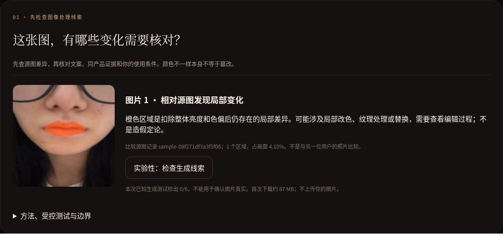
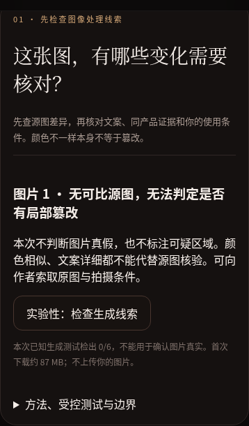
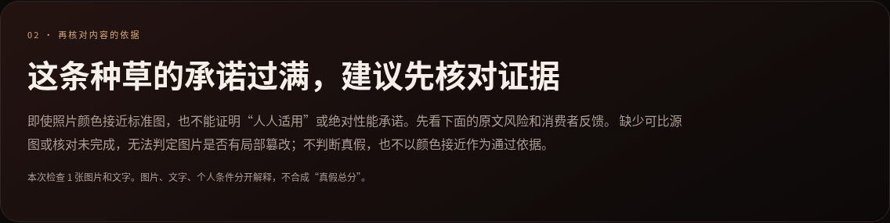

# A / B / C 验收记录（2026-10-07）

桌面 1280×900 与手机 390×844 都使用真实 BiSeNet 唇部分割和网站相同算法完成；结果不是页面预设答案。核验范围是用户指定的三种行为，是已知输入的验收回归，不是新的独立准确率评估。

| 案例 | 实际结果 | 结论 |
|---|---|---|
| A 局部改色 | 受控较强局部改色被检出；橙色叠加实际改变了区域像素，总结建议索取原图与编辑过程 | 通过 |
| B 无可比源图 | 明确显示“无可比源图，无法判定是否有局部篡改”；不显示区域，不给真假结论。详实文案也不会把图片核验变成通过 | 修正后通过 |
| C 文案风险 | YSL 610 原始官方图真实计算颜色相似度 100/100；绝对适配、性能承诺仍触发谨慎核验与文案核对建议 | 通过 |
| C 版本风险 | 兰蔻 274 原始官方图真实计算颜色相似度 100/100；文案未说明版本，仍触发确认产品线与版本 | 通过 |

原上线版本的 A 已通过，B 的源图模块没有猜测，但总标题未充分表达图像待核验。此次修正只更新展示与证据编排，未调低任何检测阈值，原受控检测代码和冻结配置不变。未知版本与历史版本都生成版本核验动作；未完成图像核验也不被视为通过。

## 实测界面

### A：橙色局部定位

### B：明确放弃图像判断

### C：颜色接近也核对文案

## 复核

`python tests/test_acceptance_abc.py` 使用本地服务；设置 `TRUETONE_TEST_URL` 可验证已上线网站。需要可访问的原始数据清单（默认本环境缓存，或 `TRUETONE_ORIGINAL_MANIFEST`）、校验过的 BiSeNet 模型和 Chromium。测试核对真实橙色像素、无源图时无区域、真实颜色分 ≥90，以及独立的文案/版本建议。

逐项文本结果与代码哈希见 [本地验收输出](abc-local-results.json)。线上部署后的测试记录单独保存，页面不读取这些记录作为答案。

A 是已知受控局部改色示例，不代表所有微小修图均能检出；原来的轻微改色、生成检测失败仍在 [受控报告](../forensics/benchmark-report.md) 公开。
